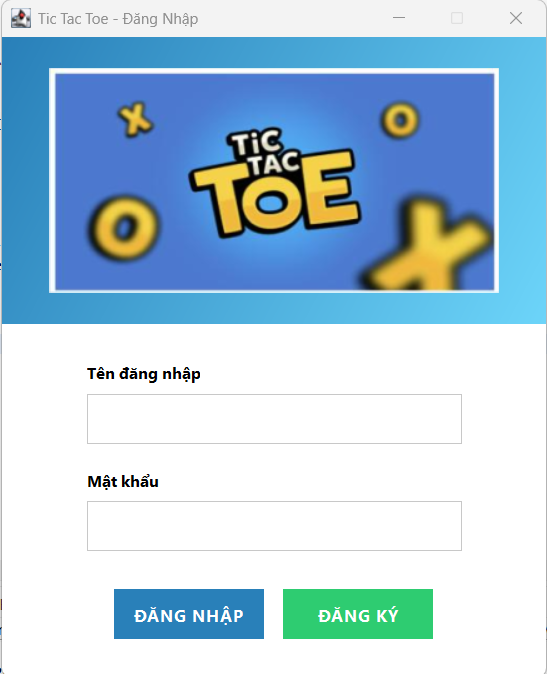
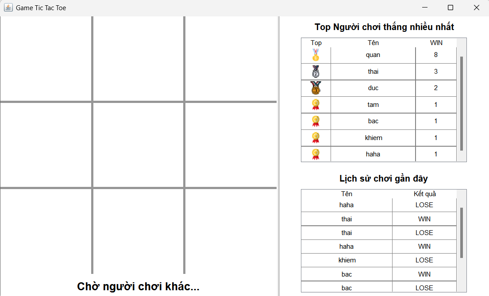

<h2 align="center">
    <a href="https://dainam.edu.vn/vi/khoa-cong-nghe-thong-tin">
    🎓 Faculty of Information Technology (DaiNam University)
    </a>
</h2>
<h2 align="center">
   GAME TIC TAC TOE (CARO 3x3)
</h2>
<div align="center">
    <p align="center">
        
        
        
    </p>

[](https://www.facebook.com/DNUAIoTLab)
[](https://dainam.edu.vn/vi/khoa-cong-nghe-thong-tin)
[](https://dainam.edu.vn)

</div>

---

## 1. Giới thiệu
**Tic Tac Toe (Caro 3x3)** là một trò chơi chiến thuật dành cho hai người chơi, sử dụng bàn cờ hình vuông 3x3 ô. Trò chơi yêu cầu người chơi lần lượt đánh dấu X hoặc O vào các ô trống, mục tiêu là tạo thành **chuỗi ba ký hiệu liên tiếp** theo hàng ngang, hàng dọc hoặc đường chéo.

Dự án này được phát triển bằng **Java** và sử dụng **TCP Socket** để giao tiếp giữa client và server. Hệ thống gồm:

- **Server**:  
  - Quản lý bàn cờ, lượt đi của người chơi.  
  - Kiểm tra trạng thái bàn cờ (thắng, thua, hòa).  
  - Ghi nhận kết quả từng ván và thông báo đến client.  

- **Client**:  
  - Giao diện người chơi sử dụng **Java Swing**.  
  - Cho phép người chơi thực hiện các lượt đi, nhận thông báo từ server.  
  - Hiển thị trạng thái trò chơi theo thời gian thực.

Trò chơi không chỉ giúp giải trí mà còn là bài tập thực hành quan trọng về **Lập trình mạng (Socket Programming)** và **Lập trình giao diện người dùng trong Java (Java Swing)**.

### 1.1. Luật chơi Tic Tac Toe 3x3

### Mục tiêu trò chơi
Người chơi X hoặc O cố gắng tạo ra **3 ký hiệu liên tiếp** theo hàng ngang, hàng dọc hoặc đường chéo trên bàn cờ 3x3. Người đầu tiên hoàn thành mục tiêu sẽ thắng ván đó.

### Quy tắc chi tiết
**Bàn cờ**:  
   - Bàn cờ bao gồm 3 hàng và 3 cột, tổng cộng 9 ô vuông.  
   - Mỗi ô có thể chứa một ký hiệu X hoặc O, hoặc để trống.  

**Người chơi**:  
   - Trò chơi dành cho hai người.  
   - Người chơi đầu tiên đánh X, người thứ hai đánh O.  
   - Các lượt đi diễn ra luân phiên.  

**Lượt đi hợp lệ**:  
   - Mỗi lượt, người chơi chỉ được đánh dấu vào **ô trống**.  
   - Sau khi điền ký hiệu, lượt sẽ chuyển sang người chơi còn lại.  

**Điều kiện thắng**:  
   - Người chơi đạt **3 ký hiệu liên tiếp** theo một trong các hướng sau:  
     - Hàng ngang  
     - Hàng dọc  
     - Đường chéo  

**Hòa**:  
   - Nếu tất cả 9 ô đã được đánh dấu mà không có người chơi nào hoàn thành 3 ký hiệu liên tiếp, ván đó kết thúc với **tỷ số hòa**.  

**Quản lý ván chơi**:  
   - Server sẽ theo dõi lượt đi và trạng thái bàn cờ.  
   - Sau khi kết thúc ván, kết quả được thông báo cho cả hai client.  
   - Trò chơi có thể chơi lại nhiều ván, dữ liệu kết quả được ghi nhận để phục vụ thống kê.  

### 1.2. Minh họa ví dụ

                                                | X | O | X |
                                                |   | O | X |
                                                | O | X |   |


## 2. Các công nghệ được sử dụng
<div align="center">

[](https://www.java.com/) [](#) [](#) [](#) [](https://maven.apache.org/) [](https://www.mongodb.com/)

</div>

---

## 3. Một số hình ảnh hệ thống

<div align="center">
  
  <p><b>Form đăng nhập đăng ký</b></p>
</div>

<br>

<div align="center">
  
  <p><b>Bảng cờ thi đấu</b></p>
</div>

<br>

---

## 4. Các bước cài đặt trên Eclipse IDE

### 4.1. Yêu cầu
- Eclipse IDE for Java Developers  
- Java JDK 17+  
- Git 
- Hệ điều hành: Windows, Linux, macOS  

### 4.2. Clone project
```bash
git clone https://github.com/Quan0804/LTM-1604-D11-Game-Tic-Tac-Toe-.git
```

### 4.3. Import vào Eclipse

- File → Import → Existing Projects into Workspace
- Chọn root directory là folder project
- Check “Copy projects into workspace” (nếu muốn)
- Finish

### 4.4. Build project

- Eclipse tự build, nếu không: Project → Build Project

### 4.5. Chạy Server

- Mở Server.java
- Run As → Java Application

### 4.6. Chạy Client

- Mở Client.java
- Run As → Java Application
- Chạy ít nhất 2 client để chơi với nhau

---

## 5. Liên hệ với tôi
📧 Email: vuquan0804@gmail.com
📞 Phone: 0364973088
🌐 Facebook: [Your Profile](https://www.facebook.com/vuquan.844/)
